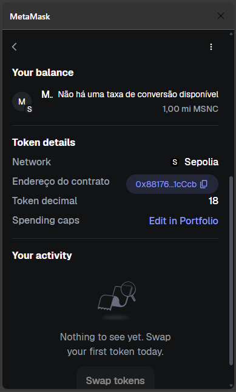
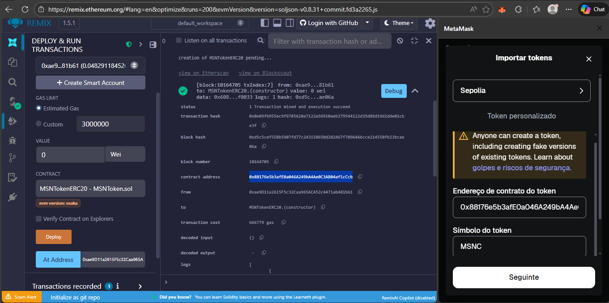
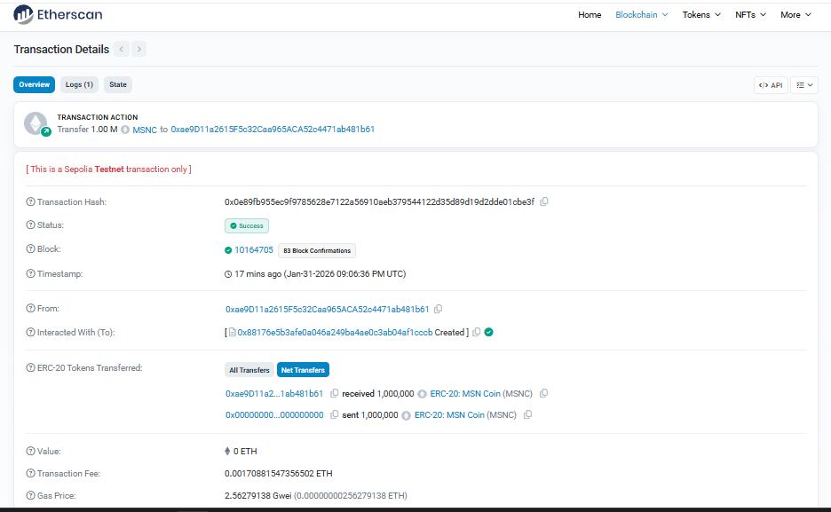

# 🚀 MSNTokenERC20 – ERC-20 Token (Sepolia)

Project developed as part of the **DIO Challenge – Creating a Token on the Ethereum Blockchain**.

The objective was to create, configure, and deploy an ERC-20 token from scratch, using **Solidity**, **Remix IDE**, and **MetaMask**, with deployment on the **Sepolia** test network.

---

## 🪙 Token Information

- **Name:** MSN Coin
- **Symbol:** MSNC
- **Decimals:** 18
- **Supply Total:** 1,000,000 MSNC

- **Standard:** ERC-20 (manual implementation)
- **Network:** Sepolia (Ethereum Testnet)

---

## 📄 Smart Contract

The contract was developed in Solidity (`^0.8.20`) and performs:
- Initial minting on deployment
- Balance storage
- Token transfer between addresses
- Issuance of `Transfer` event

📂 Source code:

`contracts/MSNTokenERC20.sol`

---

## 🔗 Blockchain Deployment

- **Contract Address:** `0x88176e5b3afE0a046A249bA4Ae0C3AB04af1cCcb`

- **Transaction Hash:**
`0x0e89fb955ec9f9785628e7122a56910aeb379544122d35d89d19d2dde01cbe3f`

The deployment was successfully completed on the Sepolia network, with the mint event confirmed on-chain.

---

## 🧪 Evidence

### Token visible in MetaMask

### Deployment via Remix

### Transaction in Etherscan

---

## 🛠️ Tools Used

- Solidity
- Remix IDE
- MetaMask
- Sepolia Testnet
- GitHub

---

## 📌 Notes

This project is educational in nature and was developed for learning purposes in Web3, Smart Contracts, and Blockchain.

---

## 👨‍💻 Author

**Marcio F. Reis** 

Challenge submitted on the **DIO (Digital Innovation One)** platform 🚀
