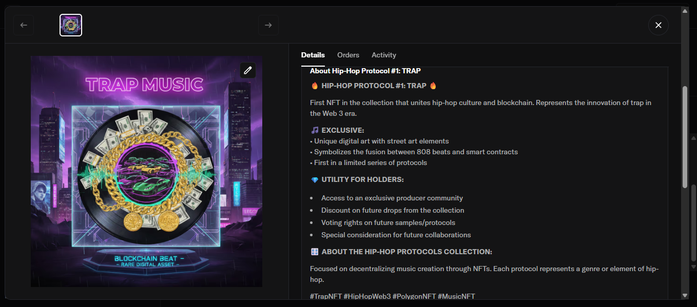
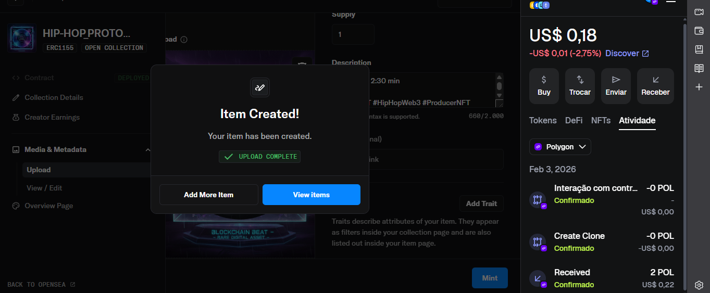

# 🎤 Musical NFT on Polygon — DIO Challenge

## 📌 Objective

Create, mine, and transfer a musical NFT using the Polygon blockchain via OpenSea, applying concepts of Web 3, smart contracts, and digital asset tokenization.

---

## 🎨 NFT

* **Name:** HIP-HOP PROTOCOL #1: TRAP
* **Collection:** HIP-HOP-PROTOCOLS
* **Type:** ERC-1155
* **Blockchain:** Polygon
* **Supply:** 1 (Single NFT)
* **Mint:** Lazy mint (gas zero)

---

## 🔗 Links

* Collection: [https://opensea.io/collection/hip-hop-protocols](https://opensea.io/collection/hip-hop-protocols)
* NFT: [https://opensea.io/item/polygon/0x965a4a9ae3d2f53d391dd379bf28b6cce9eb02d8/1](https://opensea.io/item/polygon/0x965a4a9ae3d2f53d391dd379bf28b6cce9eb02d8/1)
* Repository: [https://github.com/marcio-marine-corps-soldier/technology/projects/dio-nft-hiphop](https://github.com/marcio-marine-corps-soldier/technology/projects/dio-nft-hiphop)

---

## 🛠 Stack used

* MetaMask
* OpenSea Studio
* Polygon Network
* IPFS (decentralized storage)
* ERC-1155 Smart Contract

---

## ⚙️ Technical Process

1. Creation of the collection and deployment of the custom contract
2. Upload of the musical asset (artwork/audio)
3. Automatic metadata generation
4. Minting via lazy mint (no gas cost)
5. Transfer of the NFT to the requested wallet

---

## 📸 Evidence

---

## 📚 Applied Concepts

* NFTs
* Digital Media Tokenization
* Smart Contracts
* IPFS
* Polygon (Layer 2, low cost)
* Web3 wallets

---

## 🚀 Result

NFT successfully published, transferred on-chain, and documented as proof of basic mastery of Web3 technologies.

---

## 👨‍💻 Author

### Marcio F. Reis

Challenge submitted on the DIO (Digital Innovation One) platform 🚀
