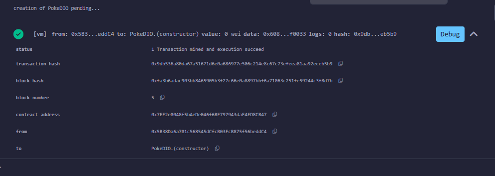
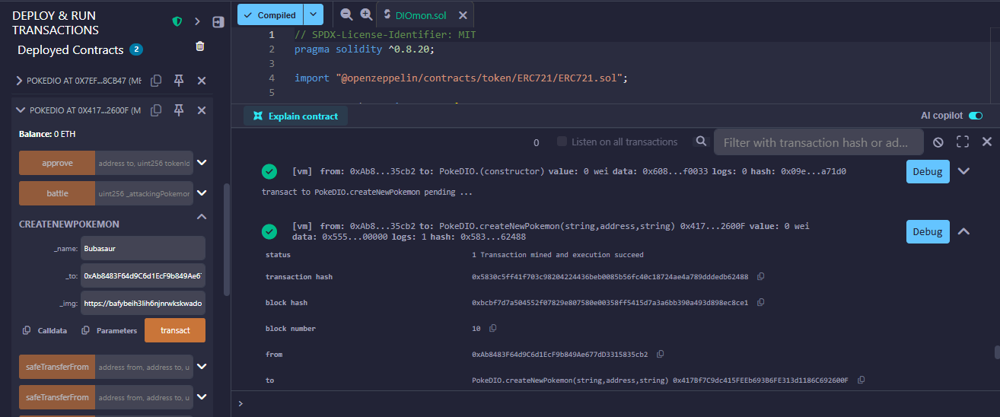
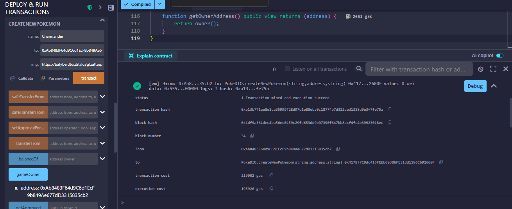
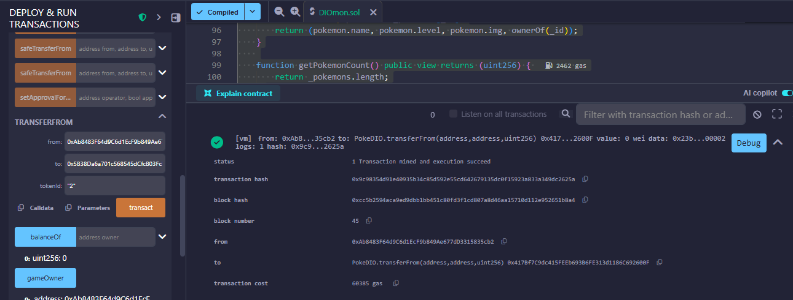

# 🎮 PokeDIO NFT Battle Game (ERC-721)


Project developed in Solidity using the ERC-721 (NFT) standard, simulating a Pokémon battle game.

DIO's practical challenge to apply concepts of:

- Smart Contracts
- Solidity
- OpenZeppelin
- ERC-721
- Deployment and testing in Remix
- Git/GitHub

---

## 🚀 Technologies
- Solidity ^0.8.20
- OpenZeppelin
- Remix IDE
- Ethereum VM (Osaka)

---

## 🧠 Concept

Each Pokémon is a unique NFT containing:

- Name
- Level
- Image (IPFS)
- Owner

Pokémon can:

✔ Be created (mint)
✔ Battle each other (level up)
✔ Be transferred between wallets

---

## 📜 Contract functionalities

### Mint
- `createNewPokemon()`
- `createMultiplePokemons()`

### Battle
- `battle(attackerId, defenderId)`

- winner gains more level

### Query
- `getPokemon(id)`

- `getPokemonCount()`

### Transfer
- native ERC-721 functions (`transferFrom`, `safeTransferFrom`)

---

## 📂 Structure

```

poke-nft-battle-dio/
│
├─ contracts/
│ └─ PokeDIO.sol
│
├─ prints/
│ ├─ deploy.png
│ ├─ create-bulbasaur.png
│ ├─ create-charmander.png
│ ├─ battle.png
│ ├─ levels-after-battle.png
│ └─ transfer.png
│
├─ README.md
├─ .gitignore
└─ LICENSE

```

---

## 🧪 Tests performed (Remix VM)

### Deploy


### Creating Bulbasaur


### Creating Charmander


### Battle


### NFT Transfer


---

## 📄 Contract

Located at:

```

contracts/PokeDIO.sol

```

---

## 🎯 Result

Functional NFTs ERC-721 with simple game mechanics (battle + level up).

Ready for future evolution:
- stats (attack/defense)
- randomization
- marketplace
- Chainlink VRF
- Web3 frontend

---

## 👨‍💻 Author
Márcio F. Reis

---

## 📄 License
This project is under the MIT License. It can be used, modified, and studied for educational purposes.
